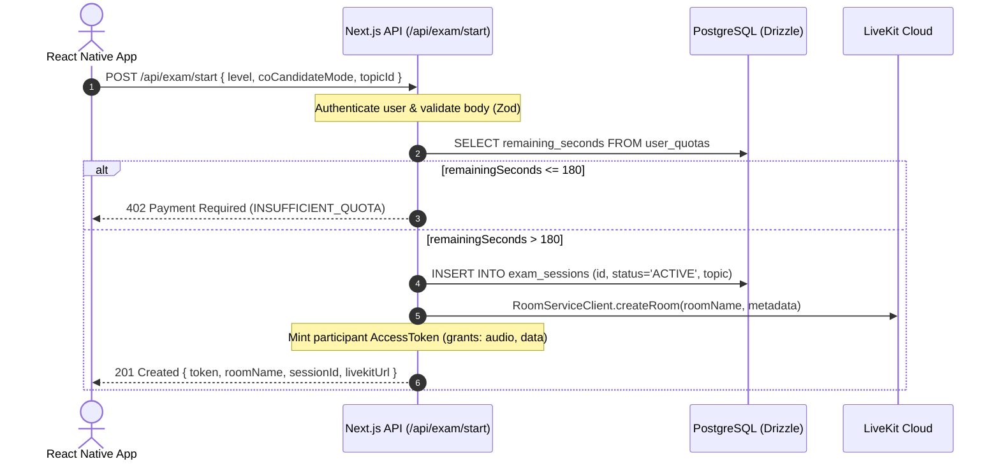
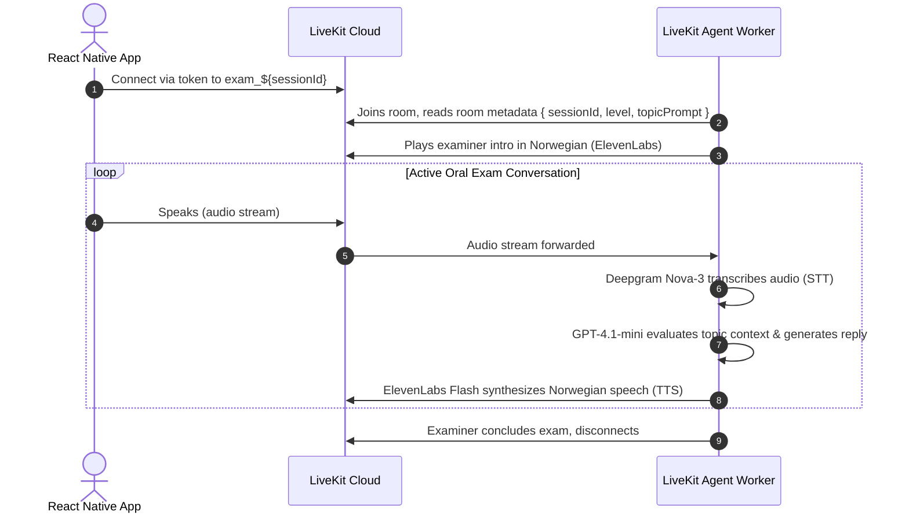
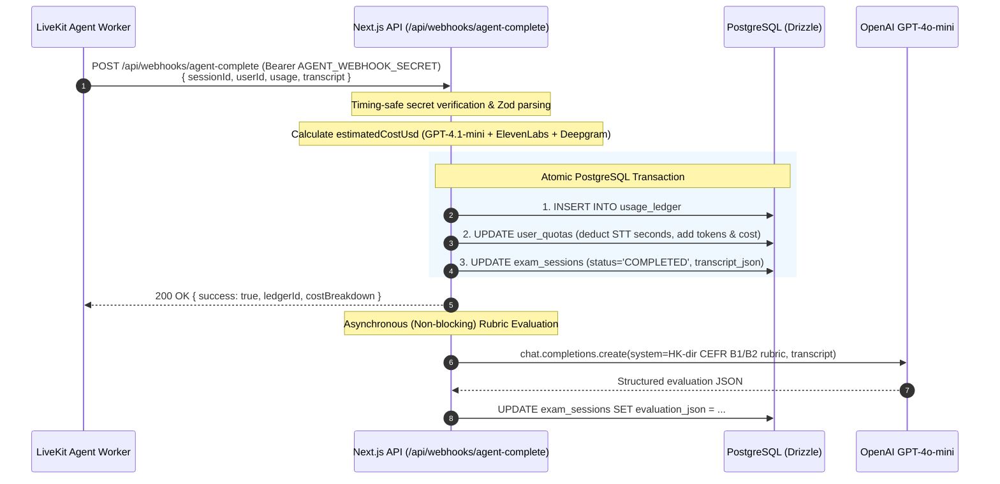

# Architecture & System Design

This document describes the architectural topology, service interactions, and lifecycle flows of the Norwegian Oral Exam Simulator backend control plane.

---

## 1. System Topology

```
┌─────────────────────────────────┐
│       React Native Client       │
│      (iOS / Android Mobile)     │
└───────────────┬─────────────────┘
                │ 1. POST /api/exam/start (Bearer token)
                │    Returns { token, roomName, sessionId, livekitUrl }
                ▼
┌────────────────────────────────────────────────────────┐
│             Next.js 15 Control Plane                   │
│   ├── /api/exam/start        (Session provision)       │
│   ├── /api/webhooks/...      (Agent completion sync)   │
│   ├── /api/exam/[sessionId]  (Result fetching)         │
│   └── /api/quota             (Quota management)        │
└────────┬───────────────────────────┬───────────────────┘
         │                           │
         │ RoomServiceClient         │ Drizzle ORM
         │ AccessToken               │ PostgreSQL
         ▼                           ▼
┌──────────────────┐        ┌──────────────────┐
│  LiveKit Cloud   │        │    PostgreSQL    │
│  (WebRTC SFU)    │        │  - user_quotas   │
└────────▲─────────┘        │  - exam_sessions │
         │                  │  - usage_ledger  │
         │ Room Join        └──────────────────┘
         │
┌────────┴──────────────────────────┐
│    LiveKit Agent Worker           │
│  (Python / Node Voice Agent)      │
│  ├── Deepgram Nova-3 (STT)        │
│  ├── GPT-4.1-mini / GPT-4o-mini   │
│  └── ElevenLabs Flash v2.5 (TTS)  │
└────────────────┬──────────────────┘
                 │
                 │ 2. POST /api/webhooks/agent-complete
                 │    (Bearer AGENT_WEBHOOK_SECRET)
                 ▼
     [Back to Next.js Control Plane]
```

---

## 2. End-to-End Execution Sequence

### Flow A: Start Practice Session



### Flow B: LiveKit Voice Session & Agent Worker



### Flow C: Webhook Ingestion & Rubric Evaluation



---

## 3. Component Responsibilities

### 1. `app/api/exam/start/route.ts`
- Verifies identity via `lib/auth.ts`.
- Enforces the **> 180 seconds** hard threshold.
- Creates unique session ID (`UUIDv4`).
- Calls LiveKit `RoomServiceClient.createRoom` with session metadata stringified.
- Mints participant `AccessToken` with a 2-hour TTL and permissions for `roomJoin`, `canPublish`, `canSubscribe`, and `canPublishData`.

### 2. `app/api/webhooks/agent-complete/route.ts`
- Validates the agent webhook bearer secret using `crypto.timingSafeEqual`.
- Validates payload structure (UUID sessionId, non-negative usage counts, transcript entry array).
- Executes `calculateEstimatedCostUsd()` across the three provider rates.
- Wraps ledger insertion, quota updates, and session transcript updates inside `db.transaction()`.
- Dispatches asynchronous CEFR rubric evaluation.

### 3. `lib/cost-calculator.ts`
- Provides cost calculations formatted to 6 decimal places (`numeric(12, 6)`).
- See [BILLING_AND_USAGE.md](./BILLING_AND_USAGE.md) for rate constants.

### 4. `lib/evaluation.ts`
- Contains the official CEFR B1/B2 assessment prompt based on Norwegian Directorate for Higher Education and Skills (HK-dir) criteria.
- Runs non-blocking and writes back to `exam_sessions.evaluation_json`.

