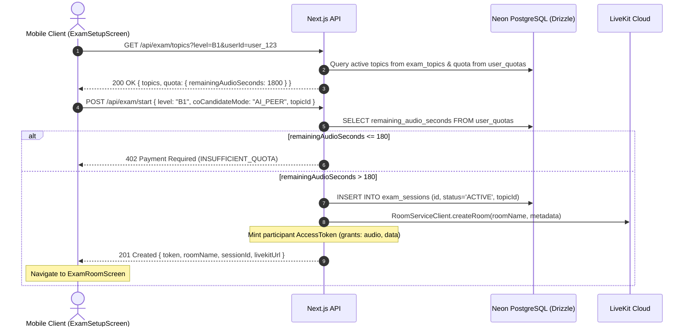
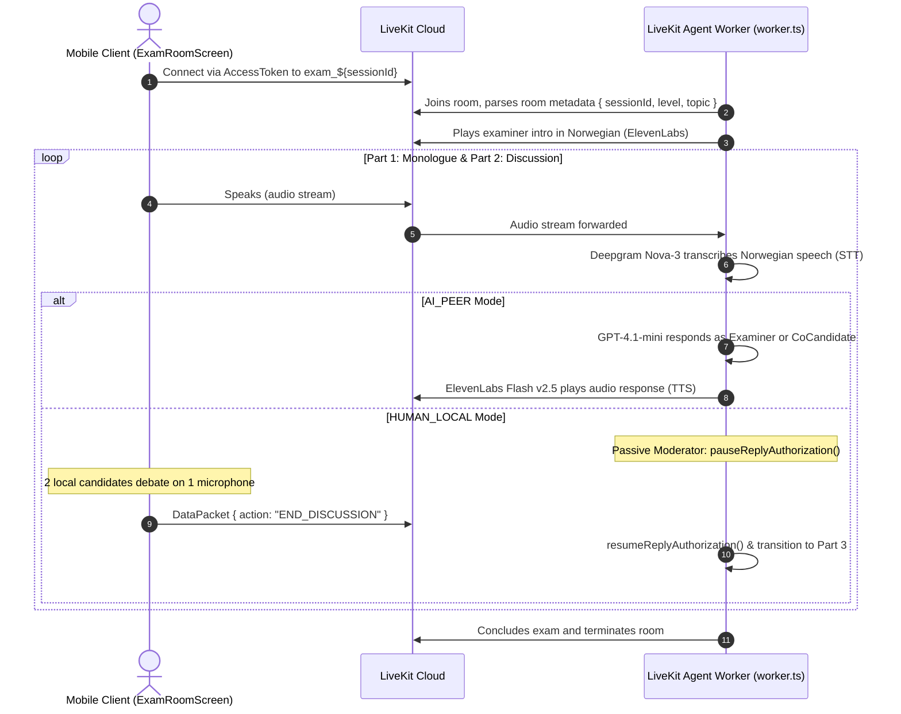
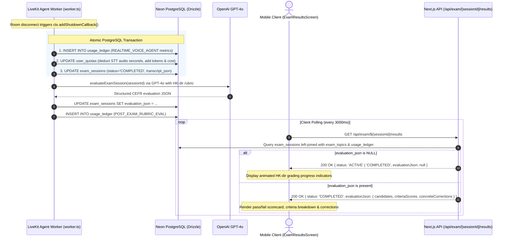

# Architecture & System Design

This document describes the architectural topology, service interactions, and lifecycle flows of the Norwegian Oral Exam Simulator across the React Native mobile client, Next.js 15 control plane, LiveKit voice agent worker, and Neon PostgreSQL database.

---

## 1. System Topology

```
┌────────────────────────────────────────────────────────┐
│               React Native Mobile Client               │
│                                                        │
│  ├── ExamSetupScreen.tsx   (Level, topic, audio test)  │
│  ├── ExamRoomScreen.tsx    (LiveKit WebRTC, waveforms) │
│  └── ExamResultsScreen.tsx (Rubric scores, corrections)│
└───────────────┬────────────────────────▲───────────────┘
                │ 1. REST API Requests   │ 4. Poll Results
                │    - GET  /api/exam/topics
                │    - POST /api/exam/start
                │    - GET  /api/exam/[sessionId]/results
                ▼                        │
┌────────────────────────────────────────┴───────────────┐
│             Next.js 15 Control Plane                   │
│   ├── /api/exam/topics       (Catalog & user quota)    │
│   ├── /api/exam/start        (Room provision & JWT)    │
│   ├── /api/exam/[sessionId]  (Session inspector)       │
│   ├── /api/exam/[sessionId]/results (Result polling)   │
│   └── /api/quota             (Quota management)        │
└────────┬───────────────────────────┬───────────────────┘
         │                           │
         │ RoomServiceClient         │ Drizzle ORM
         │ AccessToken               │ PostgreSQL Pool
         ▼                           ▼
┌──────────────────┐        ┌──────────────────────────────────────┐
│  LiveKit Cloud   │        │     Neon PostgreSQL (Drizzle)        │
│  (WebRTC SFU)    │        │  - exam_topics                       │
└────────▲─────────┘        │  - user_quotas                       │
         │                  │  - exam_sessions                     │
         │ WebRTC Audio     │  - usage_ledger                      │
         │ & DataPackets    └──────────────────▲───────────────────┘
┌────────┴──────────────────────────┐          │ Direct Atomic DB Transaction
│ LiveKit Voice Agent Worker        │          │ on ctx.addShutdownCallback
│ (src/agent/worker.ts)             │──────────┘ (ZERO HTTP Webhook Handshake)
│  ├── ExaminerAgent (HK-dir Sensor)│
│  ├── CoCandidateAgent (AI Peer)   │
│  ├── Passive Moderator Mode       │
│  ├── Deepgram Nova-3 (STT)        │
│  ├── GPT-4.1-mini (Conversation)  │
│  ├── ElevenLabs Flash v2.5 (TTS)  │
│  └── evaluateExamSession (GPT-4o) │
└───────────────────────────────────┘
```

---

## 2. End-to-End Execution Sequence

### Flow A: Catalog Discovery & Session Provision



### Flow B: LiveKit Real-Time Exam Session



### Flow C: Zero-Webhook Persistence & Client Polling



---

## 3. Component Responsibilities

### 1. Mobile Client Screens (`src/screens/*`)
- **`ExamSetupScreen.tsx`**:
  - Fetches topic catalog and remaining seconds from `GET /api/exam/topics`.
  - Enforces minimum quota (> 180s) before dispatching session creation.
  - Calls `POST /api/exam/start` and passes connection parameters to `ExamRoomScreen`.
- **`ExamRoomScreen.tsx`**:
  - Establishes WebRTC connection via `@livekit/react-native`.
  - Visualizes active speaker waveform bars and avatars for Examiner, Candidate, and AI Co-Candidate.
  - Automatically appends and auto-scrolls live transcript turns.
  - In `HUMAN_LOCAL` mode, provides manual discussion conclusion via `END_DISCUSSION` DataPacket.
  - On room exit, navigates to `ExamResultsScreen`.
- **`ExamResultsScreen.tsx`**:
  - Polls `GET /api/exam/[sessionId]/results` with interval polling.
  - Displays CEFR result cards, 4 criteria radar/scores (1–10), bilingual examiner comments, and key before/after corrections.
  - Supports candidate tabs (`CANDIDATE_1` vs `CANDIDATE_2`) for local partner exams.
  - Features an infrastructure cost & token audit drawer.

### 2. Next.js 15 Control Plane (`app/api/*`)
- **`app/api/exam/topics/route.ts`**: Returns active B1/B2 exam topics from `exam_topics` and initializes/returns the candidate's quota row.
- **`app/api/exam/start/route.ts`**: Enforces `remainingAudioSeconds > 180`, inserts `exam_sessions`, creates a LiveKit room, and mints an `AccessToken`.
- **`app/api/exam/[sessionId]/route.ts`**: Returns session status, transcript, and evaluation metadata for authenticated inspect operations.
- **`app/api/exam/[sessionId]/results/route.ts`**: Optimized results polling endpoint returning evaluation, topic details, and usage audit entries.
- **`app/api/quota/route.ts`**: Manages quota queries and top-up transactions.

### 3. LiveKit Voice Agent Worker (`src/agent/worker.ts`)
- Prewarms Silero VAD (0.9s silence threshold).
- Dispatches Norwegian STT with Deepgram Nova-3 and ElevenLabs Flash v2.5 TTS.
- Manages `ExaminerAgent` and `CoCandidateAgent` personas and turn handoffs.
- Enforces Passive Moderator Mode for `HUMAN_LOCAL` sessions.
- Directly persists usage, transcript, and initiates post-exam rubric evaluation on shutdown with zero external webhooks.

### 4. Post-Exam Rubric Evaluator (`src/lib/evaluate-exam.ts`)
- Implements official HK-dir criteria for B1 and B2 oral proficiency.
- Evaluates transcripts using OpenAI `gpt-4o` (or rule-based fallback).
- Writes evaluation JSON directly to `exam_sessions` in Neon PostgreSQL and logs cost metrics to `usage_ledger`.
