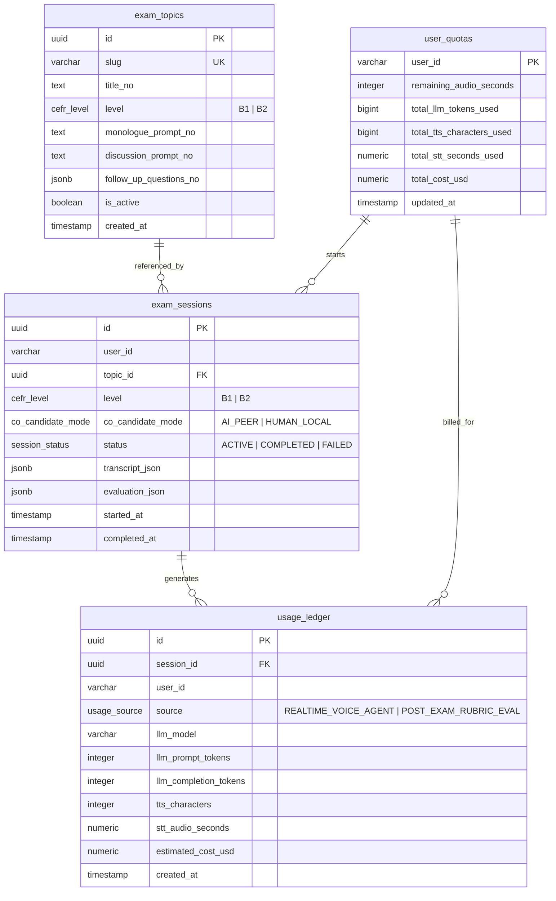

# Database Schema & Models

The database layer is managed using **PostgreSQL** (hosted on Neon Serverless) and **Drizzle ORM** with TypeScript type generation. The active schema is defined in [`src/db/schema.ts`](../src/db/schema.ts).

---

## 1. Entity Relationship Diagram (ERD)



---

## 2. PostgreSQL Tables & Columns

### 2.1 `exam_topics`
Catalog of official HK-dir B1 and B2 oral examination topics.

| Column | Type | Constraints | Description |
| :--- | :--- | :--- | :--- |
| `id` | `UUID` | `PRIMARY KEY`, `DEFAULT gen_random_uuid()` | Unique topic UUID. |
| `slug` | `VARCHAR(100)` | `NOT NULL`, `UNIQUE` | URL-safe identifier (e.g. `'kollektivtransport-gratis'`). |
| `title_no` | `TEXT` | `NOT NULL` | Official Norwegian title. |
| `level` | `cefr_level` | `NOT NULL` | Target level (`'B1'` or `'B2'`). |
| `monologue_prompt_no` | `TEXT` | `NOT NULL` | Prompt for Part 1 individual monologue. |
| `discussion_prompt_no`| `TEXT` | `NOT NULL` | Prompt for Part 2 debate/discussion. |
| `follow_up_questions_no`| `JSONB` | `NOT NULL`, `$type<string[]>` | Array of follow-up questions for Part 3. |
| `is_active` | `BOOLEAN` | `NOT NULL`, `DEFAULT true` | Topic availability flag. |
| `created_at` | `TIMESTAMPTZ`| `NOT NULL`, `DEFAULT now()` | Topic creation timestamp. |

### 2.2 `user_quotas`
Tracks candidate audio seconds balance and cumulative provider billing metrics.

| Column | Type | Constraints | Description |
| :--- | :--- | :--- | :--- |
| `user_id` | `VARCHAR(128)` | `PRIMARY KEY` | Candidate user ID. |
| `remaining_audio_seconds` | `INTEGER` | `NOT NULL`, `DEFAULT 1800` | Practice balance in seconds. Must be > 180 to start exam. |
| `total_llm_tokens_used` | `BIGINT` | `NOT NULL`, `DEFAULT 0` | Cumulative LLM prompt + completion tokens. |
| `total_tts_characters_used`| `BIGINT` | `NOT NULL`, `DEFAULT 0` | Cumulative synthesized characters via ElevenLabs. |
| `total_stt_seconds_used` | `NUMERIC(10, 2)` | `NOT NULL`, `DEFAULT '0'` | Cumulative transcribed candidate speech seconds. |
| `total_cost_usd` | `NUMERIC(10, 6)` | `NOT NULL`, `DEFAULT '0'` | Lifetime estimated cost across all providers. |
| `updated_at` | `TIMESTAMPTZ` | `NOT NULL`, `DEFAULT now()` | Last update timestamp. |

### 2.3 `exam_sessions`
Records each practice exam session, conversational transcript turns, and post-exam rubric scorecard.

| Column | Type | Constraints | Description |
| :--- | :--- | :--- | :--- |
| `id` | `UUID` | `PRIMARY KEY`, `DEFAULT gen_random_uuid()` | Unique exam session identifier. |
| `user_id` | `VARCHAR(128)` | `NOT NULL` | Owning candidate ID (indexed). |
| `topic_id` | `UUID` | `NULLABLE`, `FK -> exam_topics(id)` | Associated exam topic (indexed). |
| `level` | `cefr_level` | `NOT NULL` | Exam level (`'B1'` or `'B2'`). |
| `co_candidate_mode` | `co_candidate_mode` | `NOT NULL` | `'AI_PEER'` or `'HUMAN_LOCAL'`. |
| `status` | `session_status` | `NOT NULL`, `DEFAULT 'ACTIVE'` | `'ACTIVE'`, `'COMPLETED'`, or `'FAILED'` (indexed). |
| `transcript_json` | `JSONB` | `NULLABLE`, `$type<TranscriptEntry[]>` | Full conversation transcript turns. |
| `evaluation_json` | `JSONB` | `NULLABLE`, `$type<ExamEvaluation>` | Complete post-exam HK-dir evaluation. |
| `started_at` | `TIMESTAMPTZ` | `NOT NULL`, `DEFAULT now()` | Session start timestamp. |
| `completed_at` | `TIMESTAMPTZ` | `NULLABLE` | Session finish timestamp. |

### 2.4 `usage_ledger`
Granular audit records of resource consumption per session and source.

| Column | Type | Constraints | Description |
| :--- | :--- | :--- | :--- |
| `id` | `UUID` | `PRIMARY KEY`, `DEFAULT gen_random_uuid()` | Unique ledger record ID. |
| `session_id` | `UUID` | `NOT NULL`, `FK -> exam_sessions(id) ON DELETE CASCADE` | Associated session (indexed). |
| `user_id` | `VARCHAR(128)` | `NOT NULL` | Candidate user ID (indexed). |
| `source` | `usage_source` | `NOT NULL` | `'REALTIME_VOICE_AGENT'` or `'POST_EXAM_RUBRIC_EVAL'`. |
| `llm_model` | `VARCHAR(64)` | `NOT NULL` | Model name (e.g. `'gpt-4.1-mini'` or `'gpt-4o'`). |
| `llm_prompt_tokens` | `INTEGER` | `NOT NULL`, `DEFAULT 0` | Input tokens consumed. |
| `llm_completion_tokens` | `INTEGER` | `NOT NULL`, `DEFAULT 0` | Output tokens generated. |
| `tts_characters` | `INTEGER` | `NOT NULL`, `DEFAULT 0` | Synthesized voice characters. |
| `stt_audio_seconds` | `NUMERIC(10, 2)` | `NOT NULL`, `DEFAULT '0'` | Audio seconds processed. |
| `estimated_cost_usd` | `NUMERIC(10, 6)` | `NOT NULL` | Calculated cost in USD for this record. |
| `created_at` | `TIMESTAMPTZ` | `NOT NULL`, `DEFAULT now()` | Audit timestamp. |

---

## 3. JSONB Data Structures

### `TranscriptEntry` (`transcript_json`)
```typescript
interface TranscriptEntry {
  speaker: string; // e.g. "Examiner", "Kandidat"
  role: 'EXAMINER' | 'AI_COCANDIDATE' | 'CANDIDATE_1' | 'CANDIDATE_2';
  text: string;
  timestamp: number; // Milliseconds Unix epoch
}
```

### `ExamEvaluation` (`evaluation_json`)
```typescript
interface CriterionScore {
  score: number; // 1 to 10 scale
  feedbackNo: string;
  feedbackEn: string;
}

interface ConcreteCorrection {
  originalQuote: string;
  correctedNorwegian: string;
  grammarOrVocabRule: string;
}

interface CandidateEvaluation {
  speakerRole: 'CANDIDATE_1' | 'CANDIDATE_2';
  targetLevel: 'B1' | 'B2';
  assessedLevel: 'Under B1' | 'B1' | 'B2' | 'Over B2';
  passedTargetLevel: boolean;
  overallSummaryNo: string;
  overallSummaryEn: string;
  criteriaScores: {
    formidlingOgFlyt: CriterionScore;
    uttaleOgForstaelighet: CriterionScore;
    ordforrad: CriterionScore;
    grammatikkOgSetningsstruktur: CriterionScore;
  };
  concreteCorrections: ConcreteCorrection[];
}

interface ExamEvaluation {
  candidates: CandidateEvaluation[];
  evaluatedAt?: string;
  insufficientData?: boolean;
  notes?: string;
}
```

---

## 4. Drizzle Configuration & Migration Commands

The Drizzle configuration resides in `drizzle.config.ts`:
```typescript
export default defineConfig({
  schema: './src/db/schema.ts',
  out: './drizzle',
  dialect: 'postgresql',
  dbCredentials: {
    url: process.env.DIRECT_DATABASE_URL || process.env.DATABASE_URL || '',
  },
});
```

- **Push Schema**: `npm run db:push` (applies schema directly to database).
- **Generate Migrations**: `npm run db:generate` (creates SQL migration files in `drizzle/`).
- **Execute Migrations**: `npm run db:migrate` (runs pending migrations).
- **Seed Database**: `npm run db:seed` (populates official topics and test user quota).
- **Inspect DB in Browser**: `npm run db:studio` (opens Drizzle Studio).
